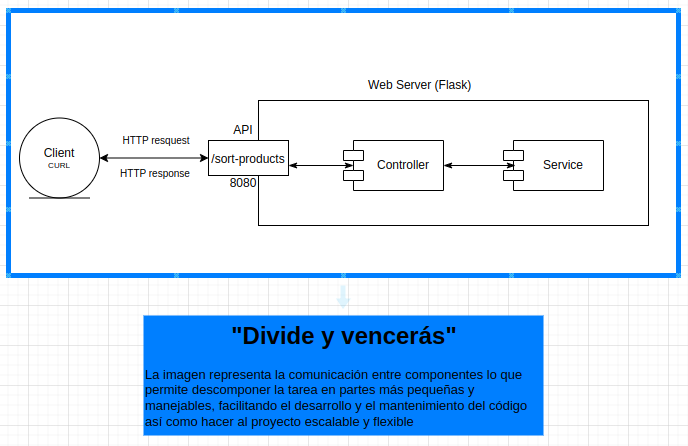
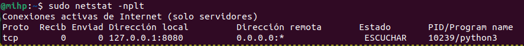
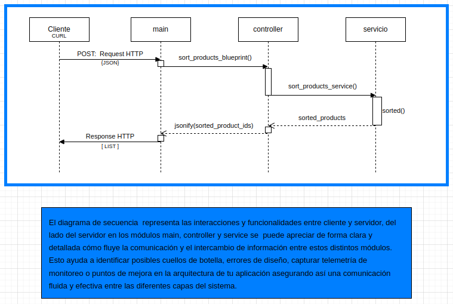

# Proyecto: Sistema de Ordenamiento de Productos v.1.0.0

## El Problema:

Una pequeña empresa de venta de productos en línea ofrece una amplia variedad de artículos en categorías como libros, videoconsolas y ropa. Recientemente, ha cerrado acuerdos con cinco proveedores de productos comestibles, ampliando las categorías. Hasta ahora, el departamento de marketing organizaba los productos manualmente, utilizando criterios intuitivos para maximizar las ventas. Con la expansión, marketing ha solicitado al departamento de sistemas que automatice este proceso de ordenación.

## Plantéo de la solución:

1.  Crear un endpoint que reciba datos de productos y devuelva una
    lista ordenada de productos según ciertos criterios.

    1.1 Entrada del Endpoint:

    - Dos listas en formato JSON:
      _ ProductSales: productos con ventas en euros (€) en las
      últimas 72 horas.
      _ ProductStock: productos con su stock actual
      (número de unidades).

      1.2 Salida del Endpoint:

    - Lista ordenada de identificadores de productos, de mayor a menor
      prioridad.

2.  Criterios de Ordenación:

    - Basar la ordenación en ventas recientes y stock disponible.
    - Las ponderaciones de ventas y stock deben ser configurables (ej. 25% para ventas y 75% para stock).

3.  Configurabilidad:
    - El endpoint debe permitir configurar ponderaciones para ventas y stock.

## Resultados del modelado UML y la implenetación.

#### Descripción General del Diagrama UML de Componentes

Se ha diseñado un diagrama de componentes para modelar la arquitectura de la API REST y especificar la distribución de los componentes así como su interactividad. La comunicación se inicia desde el cliente (comando curl) hacia el endpoint RESTful que está disponible en el puerto 8080, específicamente en el recurso "/sort-product". Este endpoint inicia la comunicación con el módulo controlador, que gestiona las solicitudes HTTP de Flask (request) para obtener los requisitos, incluyendo los encabezados (Headers) y el cuerpo (Body) de la petición. Esta información se utiliza como entrada para las funcionalidades del módulo de servicio.

En el módulo de servicio, se lleva a cabo el proceso de ordenamiento de los productos en función de las ponderaciones, las ventas y el stock disponible. El resultado de esta operación se envía de regreso al controlador, que lo devuelve al cliente a través de una respuesta HTTP.



#### netstat conexiones TCP y puerto

El servidor web está configurado para escuchar en el puerto 8080 y en la dirección IP de loopback 127.0.0.1, redirigiendo las solicitudes HTTP a la aplicación Python desarrollada con el microframework Flask. Por otro lado, se usa el comando netstat para mostrar los servicios y su estado en el sistema operativo.



#### Descripción General del Diagrama UML de Secuencia

Este diagrama UML de secuencia representa el proceso mediante el cual un cliente solicita ordenar productos a través de una API REST definida en el módulo main. La solicitud se maneja mediante flujos que involucran varios componentes: el cliente, el controlador, y el servicio que ejecuta la lógica de para ordenar productos.

**_Componentes del Diagrama_**

**Cliente**: Este módulo representa al sistema que inicia la acción. En este caso, envía una solicitud POST a la API usando el comando CURL.

- Acción: El cliente envía un request POST usando el comando curl por línea comando que incluye datos en formato JSON. Este request contiene información sobre productos y valores de ponderación, los cuales son necesarios para realizar la clasificación de productos.

**Main**: El módulo main actúa como el punto de entrada de la API. Utiliza un Blueprint llamado sort_products_blueprint para definir los endpoints asociados con la funcionalidad de ordenación de productos.

- Acción: Cuando el main recibe la solicitud en el endpoint /sort-products, se activa la función sort_products_blueprint(). Esta función actúa como entrada para las funcionalidades que procesan los datos recibidos en la solicitud HTTP en el controlador y, a su vez, se comunica con funcionalidades de otros módulos, como el servicio de ordenación de productos (sort_products_service).

**Controlador**: En este contexto, el controlador es el endpoint que gestiona la lógica de la aplicación, verificando y pasando datos entre el cliente y el servicio.

- Acción: Llama a la función sort_products_service() al recibir los datos en el endpoint, enviando las variables necesarias para el cálculo.

**Servicio**: El módulo de servicio contiene la lógica central para la ordenación de productos según los criterios definidos. Aquí se lleva a cabo el procesamiento de datos para determinar qué productos deben tener prioridad en función de sus puntuaciones.

- Acción: La función sort_products() con alias sort_products_service() toma los datos, ordena los productos según sus valores de ponderación, ventas y stock, y retorna una lista de identificadores de productos ordenados usando la función sorted().



Finalmente, este diagrama UML de secuencia representa la comunicación entre los módulos involucrados en el proceso de ordenación de productos a través de sus funcionalidades, tomando en cuenta criterios de ventas y stock y ponderaciones.

### API de Ordenación de Productos

Esta es una API RESTful construida con el microframework Flask que permite ordenar productos según el valor de sus ventas y stock.

### Instalación

1. Clonar el repositorio.
2. Navega al directorio del proyecto.
3. Crea un entorno virtual (opcional pero recomendado):

   ```bash
   python -m venv venv
   source venv/bin/activate  # En Linux o Mac
   venv\Scripts\activate     # En Windows

   ```

4. Instala las dependencias

   ```bash
   pip install -r requirements.txt
   ```

5. Ejecución: Ejecuta la aplicación con el siguiente comando:

   ```bash
   python main.py
   ```

6. Uso del Endpoint: Para probar el endpoint, usa el siguiente cURL:

```bash
curl -X POST 'http://localhost:8080/sort-products' -H 'Content-Type: application/json' -d '{
  "salesWeight": 0.5,
  "stockWeight": 0.5,
  "productSales": [
    {"productId": "1", "sales": 50000},
    {"productId": "2", "sales": 100000},
    {"productId": "3", "sales": 100000},
    {"productId": "4", "sales": 75000}
  ],
  "productStock": [
    {"productId": "1", "stock": 100000},
    {"productId": "2", "stock": 400000},
    {"productId": "3", "stock": 200000},
    {"productId": "4", "stock": 300000}
  ]
}'
```

7. Respuesta: La respuesta será una lista de identificadores de productos ordenada de mayor a menor prioridad.

```bash
@mihp:~$ curl -X POST 'http://localhost:8080/sort-products' -H 'Content-Type: application/json' -d '{
  "salesWeight": 0.5,
  "stockWeight": 0.5,
  "productSales": [
    {"productId": "1", "sales": 50000},
    {"productId": "2", "sales": 100000},
    {"productId": "3", "sales": 100000},
    {"productId": "4", "sales": 75000}
  ],
  "productStock": [
    {"productId": "1", "stock": 100000},
    {"productId": "2", "stock": 400000},
    {"productId": "3", "stock": 200000},
    {"productId": "4", "stock": 300000}
  ]
}'
#output
[
  "2",
  "4",
  "3",
  "1"
]
```

### Conclusión

Con esta estructura, se obtiene una API RESTful básica usando Flask y cumpliendo con los requisitos de la especificación de alineamiento.
